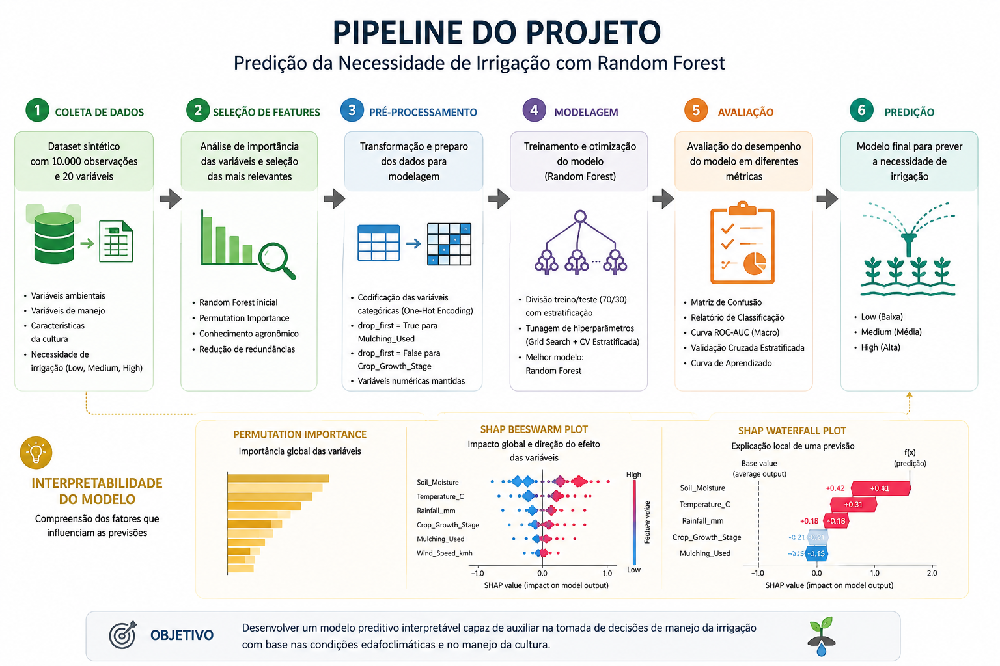

# Predição da Necessidade de Irrigação com Random Forest


## Visão Geral
Este projeto tem como objetivo prever a necessidade de irrigação de uma cultura agrícola (baixa, média ou alta) utilizando variáveis ambientais e de manejo por meio de um conjunto de dados sintético.

O modelo foi desenvolvido para demonstrar a aplicação de técnicas de Machine Learning em problemas agrícolas, incluindo seleção de atributos, classificação supervisionada, validação cruzada, otimização de hiperparâmetros e interpretabilidade de modelos.

Embora o conjunto de dados seja sintético, o fluxo de trabalho empregado segue práticas amplamente utilizadas em projetos reais de Ciência de Dados e Agricultura Digital, permitindo explorar como fatores edafoclimáticos e de manejo podem influenciar a necessidade de irrigação.

O projeto utiliza o algoritmo Random Forest para modelagem preditiva e ferramentas como Permutation Importance e SHAP para interpretação dos resultados e compreensão da contribuição de cada variável para as previsões realizadas.



## Conjunto de Dados
O dataset contêm 10000 observações e inclui as seguintes features:

- Soil_Type
- Soil_pH
- Soil_Moisture
- Organic_Carbon
- Electrical_Conductivity
- Temperature_C
- Humidity
- Rainfall_mm
- Sunlight_Hours
- Wind_Speed_kmh
- Crop_Type
- Crop_Growth_Stage
- Season
- Irrigation_Type
- Water_Source
- Field_Area_hectare
- Mulching_Used
- Previous_Irrigation_mm
- Region
- Irrigation_Need

## Metodologia

### 1. Seleção Inicial de Features
O processo de modelagem começou utilizando todas as variáveis disponíveis no conjunto de dados.

Um modelo inicial de Random Forest foi treinado usando o conjunto completo de features para avaliar sua importância individual.

A análise das importâncias de cada feature indicou que:

- A umidade do solo (Soil_Moisture) apresentou elevada importância preditiva e capturou parte da informação representada por outras variáveis do conjunto de dados;
- Features como Soil_pH, Organic_Carbon, Region e Water_Source apresentaram baixa contribuição para o desempenho preditivo do modelo. Além disso, sua inclusão aumentava a complexidade das árvores sem ganhos significativos de desempenho;
- Variáveis meteorológicas como Temperature_C, Rainfall_mm, Wind_Speed_kmh contribuiram significamente na construção do modelo, visto que fazem parte da definição de parâmetros agronômicos considerados na determinação da evapotranspiração de cultura e na decisão de irrigar;
- O estágio de desenvolvimento da cultura e o uso de mulching são features que influenciam bastante na previsão de irrigação, tornando-as peça fundamental na construção do modelo.

Com base nisso, foram selecionadas as características preditoras listadas abaixo:

- Soil_Moisture
- Rainfall_mm
- Temperature_C
- Wind_Speed_kmh
- Mulching_Used
- Crop_Growth_Stage


### 2. Preparação dos dados
A variável-resposta Irrigation_Need foi transformadas em nível de irrigação, correspondendo a 0 (Low), 1 (Medium) e High (2).

As variáveis categóricas Mulching_Used e Crop_Growth_Stage foram transformadas usando One-Hot-Encoding, sendo que para Mulching_Used foi usado o argumento ```drop_first = True``` para remover a redundância. Crop_Growth_Stage utilizou ```drop_first = False``` visto que não correspondia a uma variável categórica binária, e sim categórica nominal.

### 3. Desenvolvimento do modelo
Foram destinados 70% do dataset para o treinamento do modelo, com estratificação da variável-resposta visto que não havia balanceamento dos dados para cada categoria de necessidade de irrigação (linhas com necessidade 'High' representavam apenas 3.36% do conjunto de dados, enquanto 'Medium' 38% e 'Low', 58.64%).

Uma Random Forest foi inicialmente treinada para obter o melhor valor de ```max_depth```, o qual correspondeu a 6, em que oferencia um bom balanceamento do modelo, evitando o underfitting e overfitting.


### 4. Avaliação e Interpretabilidade do Modelo
O modelo foi avaliado considerando as seguintes análises:

- Matriz de Confusão (Confusion Matrix)
- Relatório de Classificação (Classification Report)
- Curva ROC-AUC (Macro)
- Validação Cruzada Estratificada (Stratified Cross Validation)
- Curva de Aprendizado do Modelo (Model Learning Curve)


A interpretabilidade do modelo foi avaliada por meio das seguintes análises:
- Permutation Importance
- SHAP Beeswarm Plot
- SHAP Waterfall Plot


### 5. Tecnologias
Em todo o desenvolvimento do modelo foram utilizadas as seguinte tecnologias:
- Python 3.14.x
- Scikit-Learn
- Pandas
- Numpy
- Matplotlib
- SHAP

## Resultados
O modelo treinando com Random Forest apresentou:

Elevada capacidade de classificação entre as três classes de necessidade de irrigação
Boa generalização entre treino e teste;
Estabilidade na validação cruzada, com F1 Macro médio de 0.979;
Pontuações na curva ROC-AUC consistentes (0.999);
Excelente interpretabilidade através de SHAP;
Identificação dos principais fatores associados à necessidade de irrigação.

Em suma, o modelo apresentou desempenho consistente nas avaliações realizadas, com boa capacidade de generalização e estabilidade durante a validação cruzada. As análises indicaram que as variáveis selecionadas foram suficientes para capturar os principais padrões associados à necessidade de irrigação, permitindo a correta classificação dos diferentes níveis de demanda hídrica, especialmente para a classe High.

## Limitações
Este projeto utiliza um conjunto de dados sintético criado para fins de demonstração.

Consequentemente, as relações entre as variáveis preditoras e a variável resposta tendem a ser mais consistentes e menos ruidosas do que aquelas observadas em sistemas agrícolas reais.

Assim, os resultados obtidos devem ser interpretados como uma validação da metodologia empregada e não como uma estimativa direta do desempenho esperado em condições reais de campo.